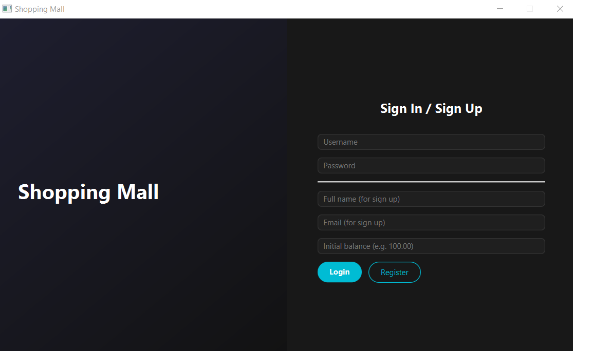
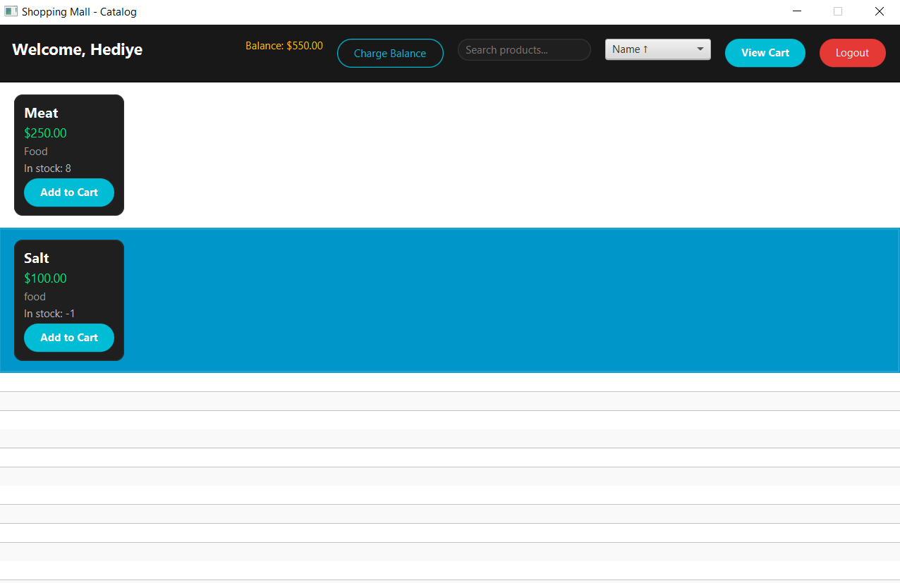
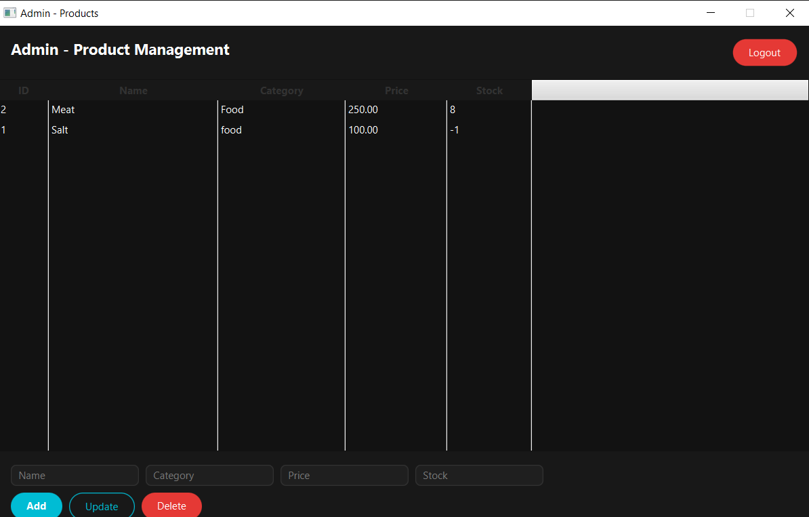

# Shopping Mall Desktop (JavaFX + PostgreSQL)

A **JavaFX desktop Shopping Mall application** built with **Java 21**, **JavaFX 21**, **Maven**, and **PostgreSQL**.  
It supports user login, browsing products, cart management, and ordering (with admin product management).

---

## ✨ Features

- User authentication (Login)
- Product catalog browsing
- Shopping cart system
- Order creation
- Admin product management
- PostgreSQL database schema included

---

## 🛠 Tech Stack

- **Java 21**
- **JavaFX 21**
- **Maven**
- **PostgreSQL**
- JDBC

---

## 📂 Project Structure

```bash
Shopping Mall/
├── db/
│   └── schema.sql
├── screenshots
├── src/
│   └── main/
│       ├── java/com/shoppingmall/
│       │   ├── MainApp.java
│       │   ├── controller/
│       │   ├── config/
│       │   ├── service/
│       │   ├── dao/
│       │   └── model/
│       └── resources/
└── pom.xml
```

---

## ⚙️ Database Setup (PostgreSQL)

### 1) Create the database
```sql
CREATE DATABASE shopping_mall;
```

### 2) Run schema
Run the script:
```bash
db/schema.sql
```

It creates these tables:
- `users`
- `products`
- `orders`
- `order_items`
- `carts`
- `cart_items`

---

## 🔑 Database Configuration

Database settings are inside:

`src/main/java/com/shoppingmall/config/DatabaseConfig.java`

Default values:
- URL: `jdbc:postgresql://localhost:5432/shopping_mall`
- USER: `postgres`
- PASSWORD: `8443`

> Change these values if your local PostgreSQL credentials are different.

---
## Screenshots

### Login Page


### Customer Page


### Admin Page

---
## ▶️ Run the Project

### 1) Clone the repository
```bash
git clone https://github.com/<your-username>/<repo-name>.git
cd <repo-name>
```

### 2) Build
```bash
mvn clean install
```

### 3) Run
```bash
mvn javafx:run
```

---

## 👤 Main Entry Point

Main class:
- `com.shoppingmall.MainApp`

---

## 📌 Notes

- Make sure PostgreSQL is running before starting the app.
- If you get connection errors, verify DB credentials in `DatabaseConfig.java`.

---

## 📜 License

This project is open-source. You can add a license (MIT recommended).
